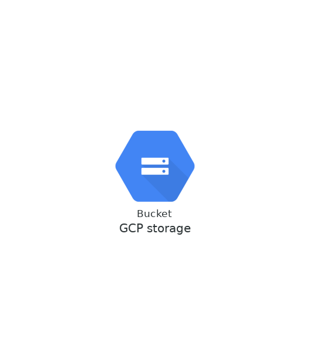

# terraform-gcp-storage

[](https://github.com/JamesWoolfenden/terraform-gcp-storage)
[](https://github.com/JamesWoolfenden/terraform-gcp-storage/releases/latest)
[](https://github.com/JamesWoolfenden/terraform-gcp-storage/releases/latest)

[](https://www.bridgecrew.cloud/link/badge?vcs=github&fullRepo=JamesWoolfenden%2Fterraform-gcp-storage&benchmark=CIS+AWS+V1.2)
[](https://github.com/pre-commit/pre-commit)
[](https://www.checkov.io/)
[](https://www.bridgecrew.cloud/link/badge?vcs=github&fullRepo=JamesWoolfenden%2Fterraform-gcp-storage&benchmark=INFRASTRUCTURE+SECURITY)
[](https://www.bridgecrew.cloud/link/badge?vcs=github&fullRepo=JamesWoolfenden%2Fterraform-gcp-storage&benchmark=CIS+GCP+V1.1)

This creates a GCP storage account.



I created this module initially to help with making a Helm repo.

I had to first create a test repo from the charts folder

```cli
helm serve --repo-path ./charts
```

This gave me a sample **index.yaml**, which I added as part of the repo creation process [it's in the template folder for the example].

I now have a public Helm repo.
https://helm-repo-examplea.storage.googleapis.com/

This example has a minimal **index.yaml**

## Adding the repo to your Helm

```cli
helm repo add baby-steps https://helm-repo-examplea.storage.googleapis.com/
"baby-steps" has been added to your repositories
```

Verify:

```cli
$helm repo list
NAME            URL
stable          https://kubernetes-charts.storage.googleapis.com
baby-steps      https://helm-repo-examplea.storage.googleapis.com/
```

## Usage

Add **module.storage.tf** to your code:-

```terraform
module "storage" {
  source        = "JamesWoolfenden/storage/gcp"
  version       = "0.2.3"
  common_tags   = var.common_tags
  binding       = var.binding
  bucket_name   = var.bucket_name
  project       = var.project
  location      = var.location
  log_bucket    = google_storage_bucket.logging.name
  force_destroy = true
}
```

## Permissions

This being GCP you'll get this error when was making this project, your service account will need these permissions, Included in the "Cloud Storage Admin" role.

```error
 examplea@examplea.iam.gserviceaccount.com does not have storage.buckets.create access to project XXXXXX, forbidden
```

<!-- BEGINNING OF PRE-COMMIT-TERRAFORM DOCS HOOK -->
## Requirements

No requirements.

## Providers

| Name | Version |
|------|---------|
| <a name="provider_google"></a> [google](#provider\_google) | n/a |

## Modules

No modules.

## Resources

| Name | Type |
|------|------|
| [google_storage_bucket.bucket](https://registry.terraform.io/providers/hashicorp/google/latest/docs/resources/storage_bucket) | resource |
| [google_storage_bucket_acl.bucketacl](https://registry.terraform.io/providers/hashicorp/google/latest/docs/resources/storage_bucket_acl) | resource |
| [google_storage_bucket_iam_binding.binding](https://registry.terraform.io/providers/hashicorp/google/latest/docs/resources/storage_bucket_iam_binding) | resource |

## Inputs

| Name | Description | Type | Default | Required |
|------|-------------|------|---------|:--------:|
| <a name="input_acl"></a> [acl](#input\_acl) | Flag to create and ACL or not, alternative is to use a bucket policy/binding | `number` | `0` | no |
| <a name="input_action_storage_class"></a> [action\_storage\_class](#input\_action\_storage\_class) | The target Storage Class of objects affected by this Lifecycle Rule. Supported values include: MULTI\_REGIONAL, REGIONAL, NEARLINE, COLDLINE, ARCHIVE | `string` | `"COLDLINE"` | no |
| <a name="input_action_type"></a> [action\_type](#input\_action\_type) | The type of the action of this Lifecycle Rule. Supported values include: Delete and SetStorageClass | `string` | `"SetStorageClass"` | no |
| <a name="input_binding_members"></a> [binding\_members](#input\_binding\_members) | n/a | `any` | n/a | yes |
| <a name="input_binding_role"></a> [binding\_role](#input\_binding\_role) | n/a | `any` | n/a | yes |
| <a name="input_bucket_name"></a> [bucket\_name](#input\_bucket\_name) | The name of the bucket | `string` | n/a | yes |
| <a name="input_common_tags"></a> [common\_tags](#input\_common\_tags) | This is to help you add tags to your cloud objects | `map(any)` | n/a | yes |
| <a name="input_cors"></a> [cors](#input\_cors) | n/a | `map` | <pre>{<br>  "max_age_seconds": null,<br>  "method": [<br>    ""<br>  ],<br>  "origin": [<br>    ""<br>  ],<br>  "response_header": [<br>    ""<br>  ]<br>}</pre> | no |
| <a name="input_force_destroy"></a> [force\_destroy](#input\_force\_destroy) | Flag to set to destroy buckets with content | `bool` | `false` | no |
| <a name="input_kms_key"></a> [kms\_key](#input\_kms\_key) | Which key to encrypt with | `string` | `""` | no |
| <a name="input_lifecycle_age"></a> [lifecycle\_age](#input\_lifecycle\_age) | Minimum (days) age of an object in days to satisfy this condition | `number` | `3` | no |
| <a name="input_location"></a> [location](#input\_location) | Where the bucket is | `string` | `"US"` | no |
| <a name="input_log_bucket"></a> [log\_bucket](#input\_log\_bucket) | Should not be itself | `string` | n/a | yes |
| <a name="input_main_page_suffix"></a> [main\_page\_suffix](#input\_main\_page\_suffix) | n/a | `string` | `null` | no |
| <a name="input_not_found_page"></a> [not\_found\_page](#input\_not\_found\_page) | n/a | `string` | `"404.html"` | no |
| <a name="input_predefined_acl"></a> [predefined\_acl](#input\_predefined\_acl) | n/a | `string` | `"private"` | no |
| <a name="input_project"></a> [project](#input\_project) | The GCP project name | `string` | n/a | yes |
| <a name="input_versioning"></a> [versioning](#input\_versioning) | n/a | `string` | `true` | no |

## Outputs

| Name | Description |
|------|-------------|
| <a name="output_bucket"></a> [bucket](#output\_bucket) | All the bucket info |
| <a name="output_url"></a> [url](#output\_url) | The Url of the statebucket |
<!-- END OF PRE-COMMIT-TERRAFORM DOCS HOOK -->

## Role and Permissions

<!-- BEGINNING OF PRE-COMMIT-PIKE DOCS HOOK -->
The Terraform resource required is:

```golang
resource "google_project_iam_custom_role" "terraformXVlBzgba" {
  project     = "examplea"
  role_id     = "terraform_pike"
  title       = "terraformXVlBzgba"
  description = "A user with least privileges"
  permissions = [
    "storage.buckets.create",
    "storage.buckets.delete",
    "storage.buckets.get",
    "storage.buckets.getIamPolicy",
    "storage.buckets.setIamPolicy",
    "storage.buckets.update",
    "storage.objects.create",
    "storage.objects.delete",
    "storage.objects.get"
  ]
}

```
<!-- END OF PRE-COMMIT-PIKE DOCS HOOK -->

## Related Projects

Check out these related projects.

- [terraform-aws-codecommit](https://github.com/jameswoolfenden/terraform-aws-codebuild) - Storing ones code

## Help

**Got a question?**

File a GitHub [issue](https://github.com/jameswoolfenden/terraform-aws-storage/issues).

## Contributing

### Bug Reports & Feature Requests

Please use the [issue tracker](https://github.com/jameswoolfenden/terraform-aws-storage/issues) to report any bugs or file feature requests.

## Copyrights

Copyright © 2019-2022 James Woolfenden

## License

[](https://opensource.org/licenses/Apache-2.0)

See [LICENSE](LICENSE) for full details.

Licensed to the Apache Software Foundation (ASF) under one
or more contributor license agreements. See the NOTICE file
distributed with this work for additional information
regarding copyright ownership. The ASF licenses this file
to you under the Apache License, Version 2.0 (the
"License"); you may not use this file except in compliance
with the License. You may obtain a copy of the License at

<https://www.apache.org/licenses/LICENSE-2.0>

Unless required by applicable law or agreed to in writing,
software distributed under the License is distributed on an
"AS IS" BASIS, WITHOUT WARRANTIES OR CONDITIONS OF ANY
KIND, either express or implied. See the License for the
specific language governing permissions and limitations
under the License.

### Contributors

[![James Woolfenden][jameswoolfenden_avatar]][jameswoolfenden_homepage]<br/>[James Woolfenden][jameswoolfenden_homepage]

[jameswoolfenden_homepage]: https://github.com/jameswoolfenden
[jameswoolfenden_avatar]: https://github.com/jameswoolfenden.png?size=150
